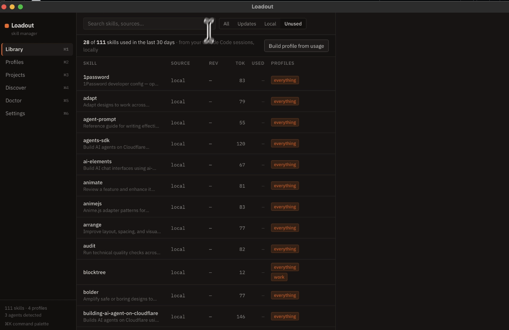

# Loadout

**Switchable skill sets for AI coding agents** · [loadout.gilla.fun](https://loadout.gilla.fun) · [7-min demo](https://youtu.be/oRy27YFjxZU)

[](https://github.com/Rohithgilla12/loadout/releases)
[](./LICENSE)
[](https://github.com/Rohithgilla12/loadout/releases)

A fast, open-source desktop app for managing the `SKILL.md`-based skills used by Claude Code, Cursor, Codex, GitHub Copilot, and friends.

> Working on a TypeScript frontend? Activate the `typescript` profile. Switching to a Go backend? One click swaps the whole skill set — instantly, offline, via symlinks.

```bash
brew install --cask rohithgilla12/loadout/loadout
```

Or grab the signed dmg / AppImage / deb / rpm from [Releases](https://github.com/Rohithgilla12/loadout/releases).



## Why

Skills today are all-on, all-the-time. Every installed skill pollutes every agent session's context — every name + description is injected into every conversation, whether the skill is relevant or not. There's no single view of what's installed where, no version pinning, no update notifications, no rollback, and no way for a team to declare "this project uses these skills."

Loadout fixes that with one primitive: **profiles** — named, switchable, shareable sets of skills.

## Features

- **Library** — one screen of truth: every skill, every agent, every scope, every version
- **Context budget meter** — see what each skill *costs*: token estimates per skill and per profile, because every description rides along in every session
- **Usage analytics (local-only)** — parse your agent transcripts to see which skills actually fire, then *build a profile from what you actually use*
- **Menu bar quick-switcher** — swap the active kit from the tray without opening the app
- **Profiles** — create, layer (base + per-project), and switch skill sets instantly
- **Projects** — assign a profile per project; commit `loadout.json` so your whole team gets the same setup
- **Discover** — browse skills.sh in-app, with a trust review before anything lands on disk
- **Safe updates** — pin-by-default, notify, diff on demand, one-click rollback
- **No Node required** — single native binary (Tauri 2 + Rust)

## How it works

Skill content lives in a content-addressed store at `~/.loadout/store`. Agent skill directories (`~/.claude/skills`, `~/.cursor/skills`, …) only ever contain symlinks into the store. Switching a profile is a symlink reconciliation — fast, atomic in effect, and fully reversible.

**The zero-data-loss invariant:** reconciliation only ever touches symlinks whose target resolves into the store. Anything else in your agent directories — hand-written skills, other tools' files — is never modified or removed.

## Repository layout

```
apps/
  desktop/   # the Tauri 2 desktop app (Rust core + React UI)
  web/       # loadout.gilla.fun — marketing site + loadout sharing
PRD.md       # the product spec
ROADMAP.md   # what's next, and why
```

## Status

🚧 Early development — building in public. See [ROADMAP.md](./ROADMAP.md) for what's next.

If Loadout looks useful, **[⭐ star the repo](https://github.com/Rohithgilla12/loadout)** — it's the main way other people find it.

## Development

```bash
pnpm install
pnpm --filter desktop tauri dev   # desktop app
pnpm --filter web dev             # web site
```

## License

MIT
