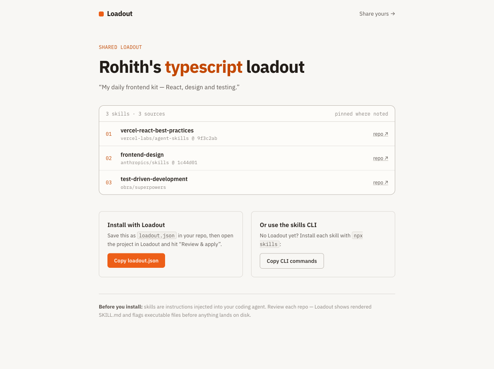

# Loadout

**Switchable skill sets for AI coding agents** · [loadout.gilla.fun](https://loadout.gilla.fun)

A fast, open-source desktop app for managing the `SKILL.md`-based skills used by Claude Code, Cursor, Codex, GitHub Copilot, and friends.

> Working on a TypeScript frontend? Activate the `typescript` profile. Switching to a Go backend? One click swaps the whole skill set — instantly, offline, via symlinks.

If Loadout looks useful, **[⭐ star the repo](https://github.com/Rohithgilla12/loadout)** — it's the main way other people find it.



## Why

Skills today are all-on, all-the-time. Every installed skill pollutes every agent session's context. There's no single view of what's installed where, no version pinning, no update notifications, no rollback, and no way for a team to declare "this project uses these skills."

Loadout fixes that with one primitive: **profiles** — named, switchable, shareable sets of skills.

## Features

- **Library** — one screen of truth: every skill, every agent, every scope, every version
- **Profiles** — create, layer (base + per-project), and switch skill sets instantly
- **Projects** — assign a profile per project; commit `loadout.json` so your whole team gets the same setup
- **Discover** — browse skills.sh in-app, with a trust review before anything lands on disk
- **Safe updates** — pin-by-default, notify, diff on demand, one-click rollback
- **No Node required** — single native binary (Tauri 2 + Rust)

## Repository layout

```
apps/
  desktop/   # the Tauri 2 desktop app (Rust core + React UI)
  web/       # loadout.dev — marketing site + loadout sharing
PRD.md       # the product spec
```

## Status

🚧 Early development — building in public. See [PRD.md](./PRD.md) for the full plan.

## Development

```bash
pnpm install
pnpm --filter desktop tauri dev   # desktop app
pnpm --filter web dev             # web site
```

## License

MIT
